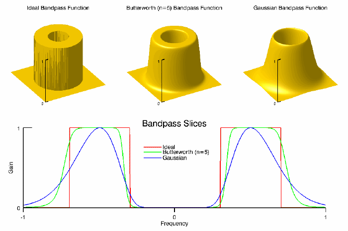
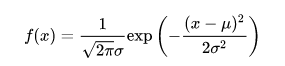
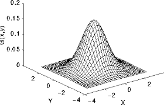
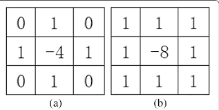
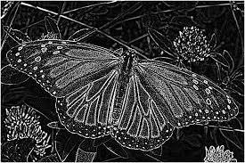

# img-filter project

## Brief introduction

One of the critical steps in image processing is _filtering_ an image. Depending on the status of the original image, one should apply different filtering techniques. In this project, we implement various image-filtering techniques using kernels and the convolution theorem.

## Configure the running environment

In this Program, the [OpenCV](https://opencv.org/) library will be used to input an image.
It is necessary to download the [OpenCV](https://opencv.org/) library and include it correctly as in our code.
The Program is written in C++.

## How to use our Program

The Program is compiled using CMake, running the following commands:

`mkdir build && cd build`

`cmake .. `

`make -j 8 && ./img_filter`

After running the Program, you will see some tips on the screen. Then follow the steps:

1. Enter the image path as the guideline suggests. (e.g., `../img/lena.jpg` or `../img/cat.jpg`)
1. Choose an image filter among the five available typing the corresponding letter:

    `l` stands for Low Pass Filter;

    `h` stands for High Pass Filter;

    `b` stands for Bandpass Filter;

    `p` stands for Laplace Filter;

    `g` stands for Gaussian Filter.

1. Choose the proper kernel size, it must be an odd number.

The output will be two images, one is the original image and the other is the processed image.
When you finish one processing, you may choose `y`, then `Enter` to continue or `q`, then `Enter` to quit.

## Final Version (version3)

The optimization process started with the profiling of the entire project using `gprof` and `valgrind`.
The profiling has shown that, as we expected, the `applyConvolution` function was the one with the highest percentage of the total running time used by the program (70% of version2 code).
Following the rule *"Don’t optimize something that’s not performance critical"*, we decided to mainly focus on this function.

Our approach was based on the following changes:
1. Accessing a pixel of the image in a C-oriented version, accessing data as `uchar` instead of `Vec3b`, using a support uchar array for the matrix data.
2. Semplifing the clamping operation allows us to remove the `if else` command inside the `for-loop`, using instead the equivalent operator.
3. Changing the type of the kernel matrix with a more suitable dimension (from `double` to `float`).
4. Removing some unused variables and setting them as constant for the invariant ones.

The benchmarks were executed using different image sizes, kernel sizes, and filters.
Images: 512x512, 1024x1001, 2048x2048.
Kernels: 3x3, 5x5, 7x7.

By using the `-O2` optimization flag, the overall improvement is:
- 35-50% with the three channel filters (LowPass, HighPass, BandPass, Gaussian).
- 9-24% with the Laplace filter, which only uses one channel convolution operation.

By using the `-O3` optimization flag, instead, the overall improvement is:
- 0-13% with the three channel filters.
- 1-23% with the Laplace filter.

## Image filters description

### Low pass filter

As the name suggests it only passes the low-frequency components of an image and removes the high-frequency content from it. Thus it is used for image smoothing and reducing the disparity among the image pixels. Generally, the Low pass filter kernel (mask) size is preferred as odd e.g 3,5,7, etc since it helps to in maintaining symmetry. The larger the kernel size, the smoother the image becomes. But also as the kernel size increases, the image becomes more blur.

### High pass filter

A high pass filter is a basis for most sharpening methods. An image is sharpened when contrast is enhanced between adjoining areas with little variation in brightness or darkness. A high pass filter tends to retain the high-frequency information within an image while reducing the low-frequency information. The kernel of the high pass filter is designed to increase the brightness of the center pixel relative to neighboring pixels.

### Bandpass filter

A bandpass filter is useful when the general location of the noise in the frequency domain is known. The bandpass filter allows frequencies within the chosen range through and attenuates frequencies outside of the given range.

### Gaussian filter

The Gaussian smoothing operator is an operator that is used to blur images and remove details and noises. In this sense, it is similar to the mean filter, but it uses a different kernel that represents the shape of a Gaussian `bell-shaped` hump. This kernel comes from the form below and it´s just a discretization. The kernel size will influence the “range” of the bell, and the variance will influence the shape of the “bell” (slender or thick).

### Laplace filter

Typically, one uses a Laplacian filter for edge detection of an image. The essence of the Laplacian operator is to find the second derivative, so when there is a large change between two adjacent pixels, such a change will be manifested. For example, Kernel (a) can detect horizontal and vertical edges, while kernel(b) can additionally detect forty-five-degree edges. They are all combinations after the array `[1 -2 1]` rotation. Here we use the second. In general, people use an odd convolution kernel size. As the convolution kernel size increases, more and more detailed edges will be detected. 

